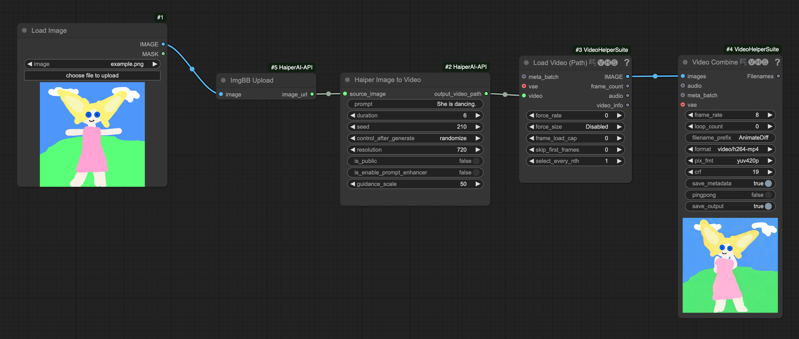
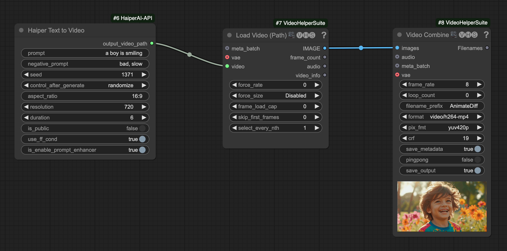
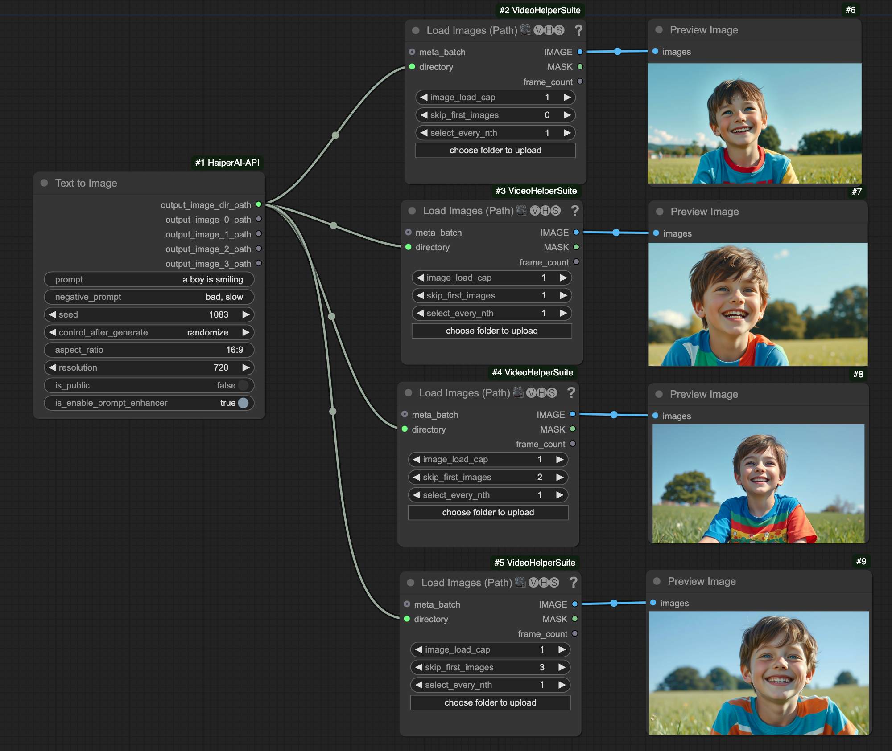
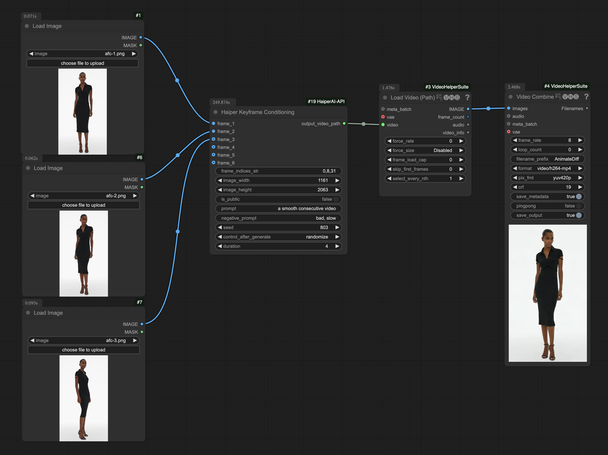

# ComfyUI-HaiperAI-API
<p align="left">
  
</p>

This is a custom node that allows you to use the Haiper AI API in ComfyUI. Haiper AI API is based on top of [Haiper AI](https://haiper.ai/), which is a video generation model developed by Haiper.
## Requirements

1. You need to have **HAIPER_KEY**. Get one [here](https://haiper.ai/haiper-api).
2. You need to carefully read the [API Documentation](https://docs.haiper.ai/api-reference) to understand how to configure the parameters.

## Installation

### Installing manually

1. Navigate to the `ComfyUI/custom_nodes` directory.

2. Clone this repository:
   ```
   git clone https://github.com/Haiper-ai/ComfyUI-HaiperAI-API.git
   ```
   The path should be `ComfyUI/custom_nodes/ComfyUI-HaiperAI-API/*`, where `*` represents all the files in this repo.

3. Install the dependencies:

  - If you are using Windows (ComfyUI portable) run: `.\python_embeded\python.exe -m pip install -r ComfyUI\custom_nodes\ComfyUI-HaiperAI-API\requirements.txt`
  - If you are using Linux or MacOS, run: `cd ComfyUI-HaiperAI-API && pip install -r requirements.txt` to install the dependencies.

4. You need to put HAIPER_KEY in the `.env` file.

5. Start ComfyUI and enjoy using the Haiper AI API node!

### Installing with ComfyUI-Manager

1. Open ComfyUI-Manager and install the Haiper AI API node (ComfyUI-HaiperAI-API).


## Nodes

### Haiper Image to Video

This node is used to generate a video from an image.

<p align="left">
  
</p>

### Haiper Text to Video

This node is used to generate a video from a text prompt.

<p align="left">
  
</p>

### Haiper Text to Image

This node is used to generate four images from a text prompt.

<p align="left">
  
</p>

### Haiper Keyframe Conditioning

This node is designed to control video generation through keyframe-based conditioning.

<p align="left">
  
</p>


## Examples

For examples, see [workflows folder](./workflows). To use, you need to install [ComfyUI-VideoHelperSuite](https://github.com/Kosinkadink/ComfyUI-VideoHelperSuite) first, then download the workflow json and import it into ComfyUI.

## API Documentation

For more information about the Haiper AI API, see [Haiper AI API Documentation](https://docs.haiper.ai/api-reference).

## Pricing

For pricing, see [Haiper AI Pricing](https://haiper.ai/enterprise-api).
