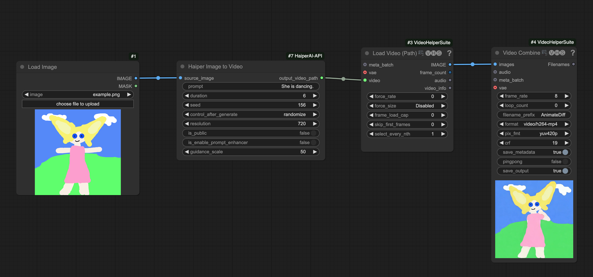
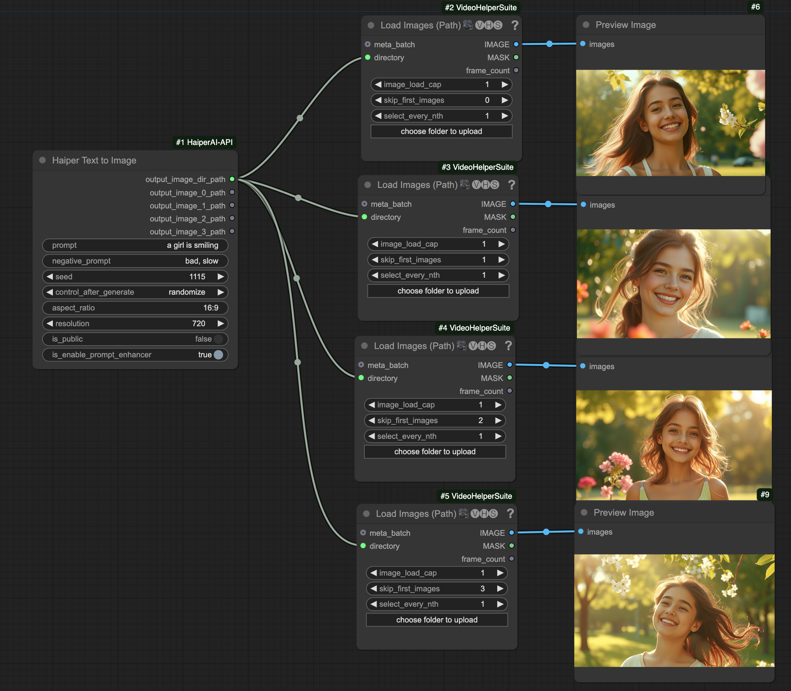

# ComfyUI-HaiperAI-API
<p align="center">
  
</p>

This is a custom node that allows you to use the Haiper AI API in ComfyUI. Haiper AI API is based on top of [Haiper AI](https://haiper.ai/), which is a video generation model developed by Haiper.
## Requirements

1. You need to have Haiper AI CLIENT_ID and CLIENT_SECRET. Get one [here](https://haiper.ai/haiper-api).
2. You need to provide an image URL as input to perform image-to-video generation. As a recommendation, you can use [ImgBB](https://api.imgbb.com/) to generate image URLs.
3. You need to carefully read the [API Documentation]((https://yxc3mmw1e9.larksuite.com/docx/RhbxdbSaZoijVgxw9PFulzVOsTc)) to understand how to configure the parameters.

## Installation

### Installing manually

1. Navigate to the `ComfyUI/custom_nodes` directory.

2. Clone this repository:
   ```
   git clone https://github.com/Haiper-ai/ComfyUI-HaiperAI-API.git
   ```
   The path should be `ComfyUI/custom_nodes/ComfyUI-HaiperAI-API/*`, where `*` represents all the files in this repo.
  
3. Install the dependencies:

  - If you are using Windows (ComfyUI portable) run: `.\python_embeded\python.exe -m pip install -r ComfyUI\custom_nodes\ComfyUI-HaiperAI-API\requirements.txt`
  - If you are using Linux or MacOS, run: `cd ComfyUI-HaiperAI-API && pip install -r requirements.txt` to install the dependencies.

4. You need to put CLIENT_ID and CLIENT_SECRET in the `.env` file.

5. You need to put IMGBB_KEY in the `.env` file.

6. Start ComfyUI and enjoy using the Haiper AI API node!

## Nodes

### ImgBB Upload

This node is used to upload an image to ImgBB and return the URL. We need this because Haiper API currently only supports image urls as input.
To use this node, you need to have an ImgBB API key. Create an account and get one [here](https://api.imgbb.com/).

<p align="left">
  
</p>

### Haiper Image to Video

This node is used to generate a video from an image.

<p align="left">
  
</p>

### Haiper Text to Video

This node is used to generate a video from a text prompt.

<p align="left">
  
</p>

### Haiper Text to Image

This node is used to generate four images from a text prompt.

<p align="left">
  
</p>

## Examples

For examples, see [workflows folder](./workflows). To use, you need to install [ComfyUI-VideoHelperSuite](https://github.com/Kosinkadink/ComfyUI-VideoHelperSuite) first, then download the workflow json and import it into ComfyUI.

## API Documentation

For more information about the Haiper AI API, see [Haiper AI API Documentation](https://yxc3mmw1e9.larksuite.com/docx/RhbxdbSaZoijVgxw9PFulzVOsTc).

## Pricing

For pricing, see [Haiper AI Pricing](https://haiper.ai/haiper-api).
